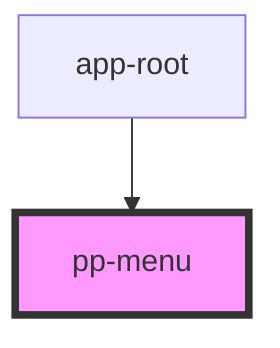

# pp-menu

<!-- Auto Generated Below -->

## Properties

| Property              | Attribute | Description | Type     | Default     |
| --------------------- | --------- | ----------- | -------- | ----------- |
| `Router` _(required)_ | --        |             | `Router` | `undefined` |

## Dependencies

### Used by

 - [app-root](../app-root)

### Graph

----------------------------------------------

*Built with [StencilJS](https://stenciljs.com/)*
